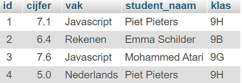
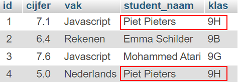

# MYSQL-ADVANCED-RELATIES-TAAK-01

## Relaties tussen database-tabellen

## Uitleg

Tot nu toe hebben we gekeken naar voorbeelden en opdrachten met een enkele tabel. Hierin hebben we gegevens opgehaald, ingevoerd, aangepast en verwijderd (CRUD). Een applicatie bestaat vaak uit vele verschillende tabellen. Een online winkel heeft bijvoorbeeld een tabel voor de klanten, een tabel voor de producten, een tabel voor de bestellingen, etc. etc.

Deze tabellen kunnen een relatie met elkaar hebben. Om twee tabellen met elkaar te verbinden maken we gebruik van een zogenaamde foreign key. Een foreign key (externe sleutel) is een veld (of velden) die verwijzen naar de primaire sleutel van een andere tabel.

Als voorbeeld nemen we een tabel toetsuitslagen. Zie onderstaande tabel:

> Wat hierbij opvalt is dat Piet hier twee cijfers heeft gehaald en er met 2 records in staat. 

In dit simpele voorbeeld is dat niet heel erg. Maar niet praktisch is dat als je bijvoorbeeld veel meer informatie wilt registreren in de database over de student. Of als je een wijziging wilt doorvoeren. Als Piet bijvoorbeeld naar een andere klas gaat, moet je dit in verschillende rijen aanpassen.

Wat je in deze situatie beter kunt doen, is gebruik maken van twee tabellen. Eén voor de cijfers en één voor alle studentinformatie. Zie voorbeeld:

In de tabel **student** is `student_id` de primary key. De waarden hiervan zijn uniek in deze tabel (komen maximaal één keer voor).

De tabel **cijfer** heeft ook een primary key, namelijk `id`. Tabel **cijfer** heeft óók een kolom `student_id`. De waarden daarvan zijn waarden die ook voorkomen in de primary key van de tabel **student**. 

> De waarde van student_id in tabel **cijfer** verwijst naar de primaire sleutel van de tabel **student** !

Zo een verwijzende kolom naar een primaty key in een andere tabel, noemen we een **foreign key** (externe sleutel). Een foreign key heeft in tegenstelling tot een primary key, niet alleen unieke waarden. In het voorbeeld, komt de waarde van Piet (1155) meerdere keren voor. Piet heeft namelijk twee toetsen gemaakt.

Stel Piet gaat naar een andere klas. Dan hoef je in de tabel **cijfer** niets te veranderen in de rijen waar Piet in voorkomt. Alleen de rij in de tabel **student** hoeft te worden aangepast.

Een tabel kan slechts één primary key hebben. Foreign keys kunnen er meerdere zijn per tabel.

## Leerdoelen

1. [ ] Ik weet wat het begrip foreign key betekent
2. [ ] Ik weet hoe een relaties worden gemaakt tussen tabellen
3. [ ] 

## Opdracht

## Eindresultaat

## Bronnen

